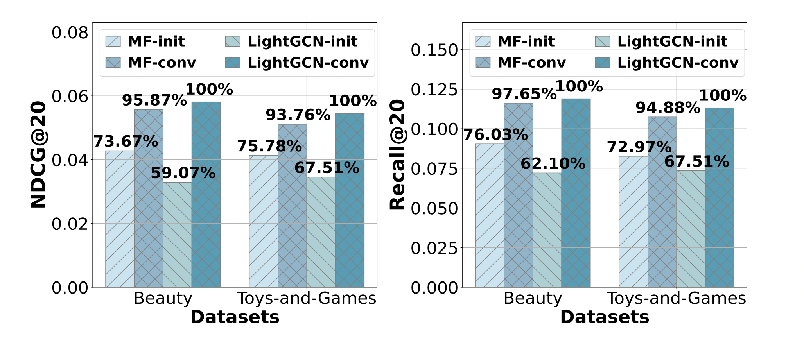
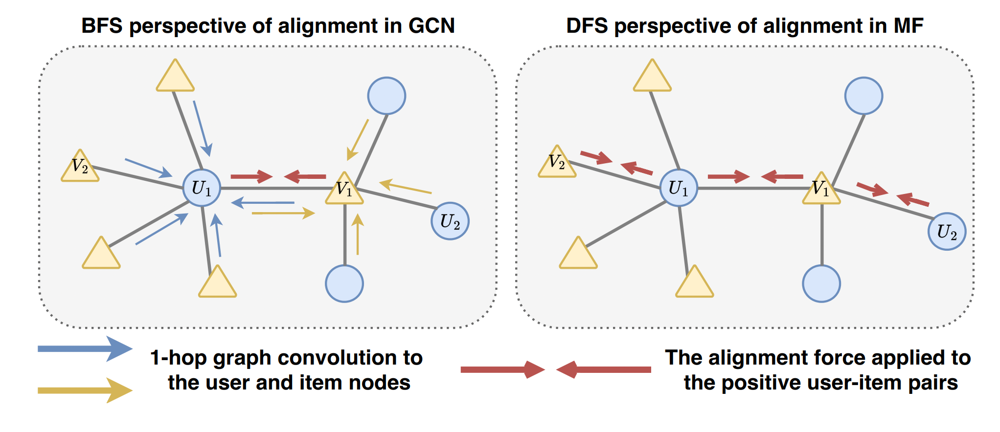
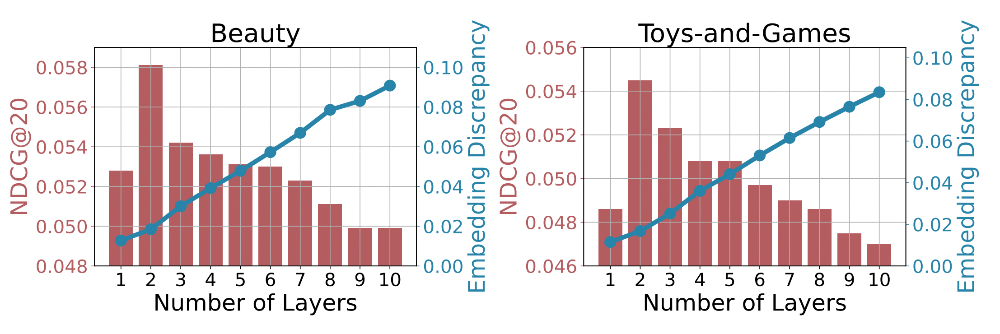

# Do We Really Need Graph Convolution During Training? Light Post-Training Graph-ODE for Efficient Recommendation

Pytorch Implementation for CIKM 2024 Full Research Track Paper: 
> **[Do We Really Need Graph Convolution During Training? Light Post-Training Graph-ODE for Efficient Recommendation](https://github.com/DavidZWZ/LightGODE).**
> 33rd ACM International Conference on Information and Knowledge , CIKM 2024 <br>
> Weizhi Zhang, Liangwei Yang, Zihe Song, Henry Peng Zou, Ke Xu, Liancheng Fang, Philip S. Yu <br>

## Investigation: Do We Really Need Graph Convolution During Training?
**Investigate the Role of Graph Convolution & Analyze it from BFS (GCN) vs DFS (MF) perspective**
<p  align="center">
  
  <br>
</p>

**Identify the Embedding Discrepancy Issue when further Increase the Depth of Post-Training Graph Convolution Layers**
<p  align="center">
  
</p>

## Solution: Light Post-Training Graph-ODE for Efficient Recommendation.


## Set up:
### Dependencies
```
pip install -r requirements.txt
```

### Dataset Preparation
Get the [Amazon_Beauty](https://recbole.s3-accelerate.amazonaws.com/ProcessedDatasets/Amazon_ratings/Amazon_Beauty.zip), [Amazon_Toys_and_Games](https://recbole.s3-accelerate.amazonaws.com/ProcessedDatasets/Amazon_ratings/Amazon_Toys_and_Games.zip), [gowalla](https://drive.google.com/file/d/1PuwawxTtrR7xjna9U6kWAQ56L2ja9dYG/view?usp=sharing) dataset under dataset folder

Please modify the file name and arrange them in the following structure:
```
LightGODE/
    ├─ Dataset/
        ├─ amazon-beauty
            ├─ amazon-beauty.inter
        ├─ amazon-toys-games
            ├─ amazon-toys-games.inter
        ├─ gowalla
            ├─ gowalla.inter
```

### Running on different datasets:

Amazon-Beauty
```
python run_recbole.py -m LightGODE -d amazon-beauty -t 1.8 -g 0.5
```

Amazon-Toys-and-Games
```
python run_recbole.py -m LightGODE -d amazon-toys-games -t 0.8 -g 0.5 -w 0
```

Gowalla
```
python run_recbole.py -m LightGODE -d gowalla -t 3 -g 10 -w 0
```

## Acknowledgement
The structure of this repo is built based on [RecBole](https://github.com/RUCAIBox/RecBole). Thanks for their great work.