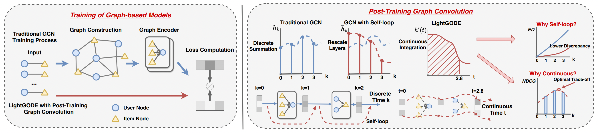

# Do We Really Need Graph Convolution During Training? Light Post-Training Graph-ODE for Efficient Recommendation

Pytorch Implementation for CIKM 2024 Full Research Track Paper: 
> **[Do We Really Need Graph Convolution During Training? Light Post-Training Graph-ODE for Efficient Recommendation](https://github.com/DavidZWZ/LightGODE).**
> 33rd ACM International Conference on Information and Knowledge , CIKM 2024 <br>
> Weizhi Zhang, Liangwei Yang, Zihe Song, Henry Peng Zou, Ke Xu, Liancheng Fang, Philip S. Yu <br>



## Set up:
### Dependencies
```
pip install -r requirements.txt
```

### Dataset Preparation
Get the beauty, toys-and-games, gowalla dataset under dataset folder
Overall file structure:
```
LightGODE/
    ├─ Dataset/
        ├─ amazon-beauty
        ├─ amazon-toys-games
        ├─ gowalla


```

### Running on different datasets:

Amazon-Beauty
```
python run_recbole.py -m LightGODE -d amazon-beauty
```

Amazon-Toys-and-Games
```
python run_recbole.py -m LightGODE -d amazon-toys-games
```

Gowalla
```
python run_recbole.py -m LightGODE -d gowalla -w 0
```

## Acknowledgement
The structure of this repo is built based on [RecBole](https://github.com/RUCAIBox/RecBole). Thanks for their great work.